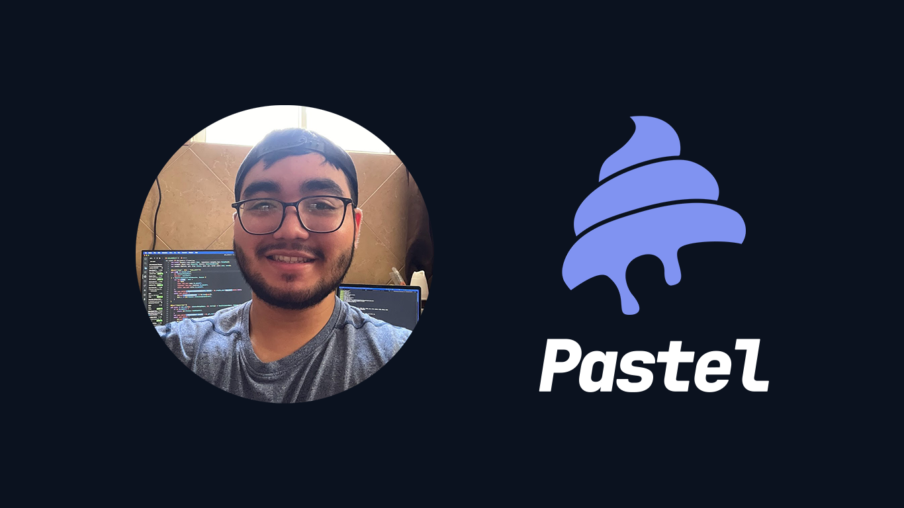

# Hello everyone 🙌🏻

This is Samuel Marroquín, founder of Pastel. In 2022 I decided to start working on what I really love: programming <3

Currently working on [NebuIA](https://nebuia.com/) and independent projects. And at night, in Pastel.

Pastel is a company dedicated to developing mobile applications with high quality and five star service.

We use Flutter and Swift for fast, efficient and comfortable development.

Contact me, we'll really enjoy working together!

Visit my website: [Pastel website](https://www.pastelcode.dev/).

