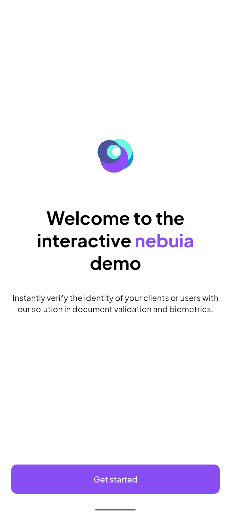
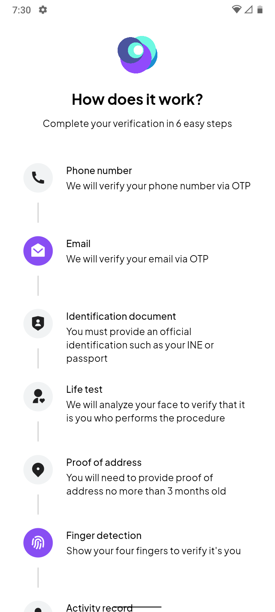
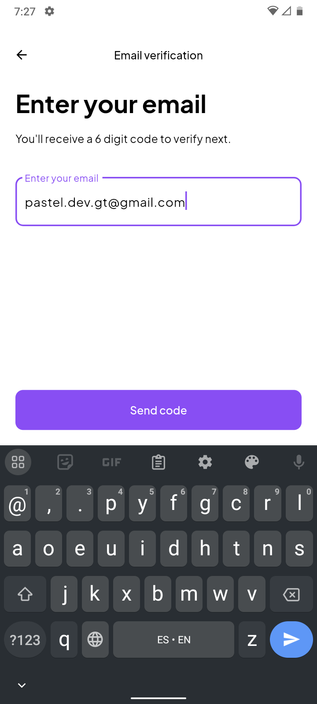
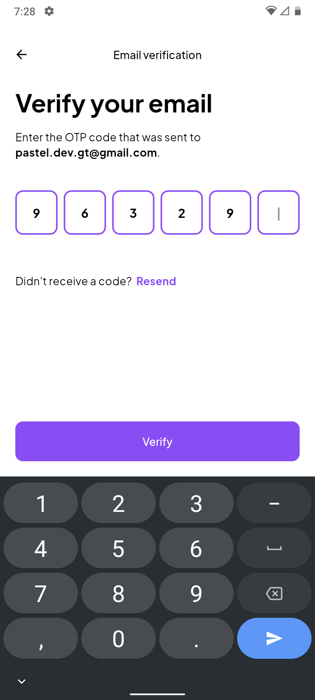
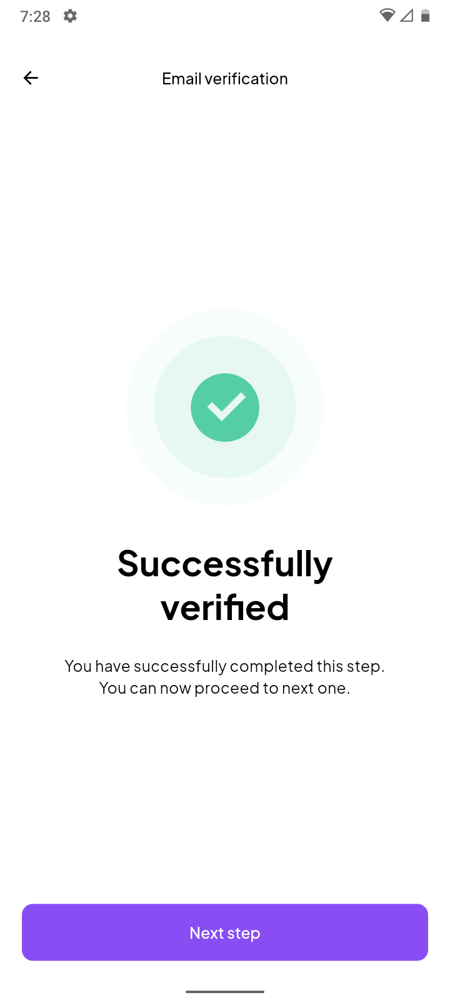
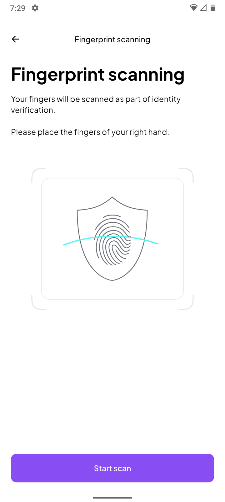
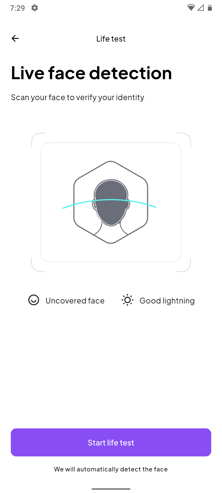

# Hello everyone 🙌🏻

This is Samuel Marroquín from Guatemala 🇬🇹, founder of Pastel. In 2022 I decided to start working on what I really love: programming <3

Currently working on [NebuIA](https://nebuia.com/), and independent projects on Pastel, my own company.

Pastel is a company dedicated to developing mobile applications with high quality and five star service.

We use Flutter and Swift for fast, efficient and comfortable development.

Contact me, we'll really enjoy working together!

Visit my website: [Pastel website](https://www.pastelcode.dev/).

# Projects

## CrediBancrea

Application made for Mexican bank Bancrea to follow status of credits and upload required information about clients. It was made to verify user identity as well.

Built with Flutter.

<table style="width: 100%">
  <tr>
    <td>
      
    </td>
    <td>
      
    </td>
    <td>
      
    </td>
  </tr>
  <tr>
    <td>
      
    </td>
    <td>
      
    </td>
    <td>
      
    </td>
  </tr>
</table>

## NebuIA Demo

NebuIA demo application to show different use cases of KYC and identity verification.
Built with Flutter.

<table style="width: 100%">
  <tr>
    <td>
      
    </td>
    <td>
      
    </td>
    <td>
      
    </td>
  </tr>
  <tr>
    <td>
      
    </td>
    <td>
      
    </td>
    <td>
      
    </td>
  </tr>
  <tr>
    <td>
      
    </td>
  </tr>
</table>

## Telec

# Contributions
